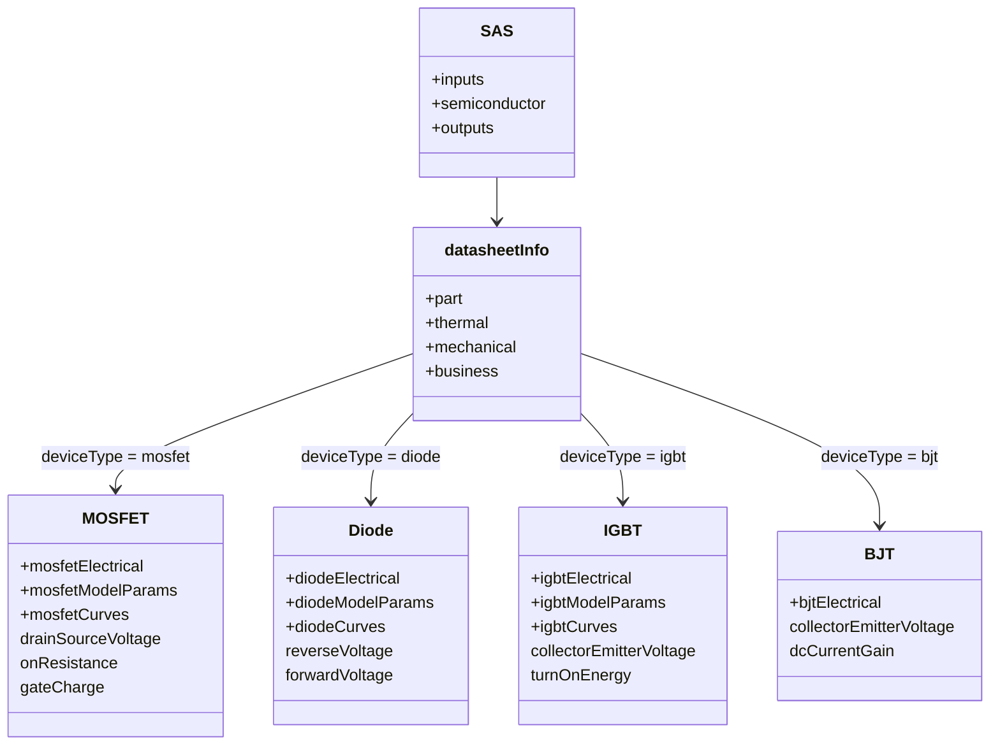
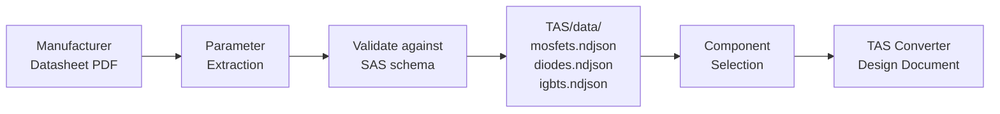

<h1 align="center">SAS - Semiconductor Agnostic Structure</h1>

<p align="center">
  <em>The universal data format for semiconductor components in power electronics</em>
</p>

<p align="center">
  <a href="https://opensource.org/licenses/MIT"></a>
  <a href="https://json-schema.org/"></a>
</p>

---

## What is SAS?

**SAS is a standardized way to describe semiconductor components** -- MOSFETs, diodes, IGBTs, and BJTs -- used in power electronics. It captures everything from absolute maximum ratings and electrical characteristics to SPICE model parameters and characteristic curves, all in a single machine-readable JSON file.

SAS is part of the **OpenConverters** family of agnostic structures:

```
PEAS (Power Electronics Agnostic Structure) -- Universal container
 |
 +-- MAS (Magnetic Agnostic Structure) -- Inductors, transformers, chokes
 +-- CAS (Capacitor Agnostic Structure) -- Capacitors
 +-- SAS (Semiconductor Agnostic Structure) -- MOSFETs, diodes, IGBTs, BJTs
 +-- RAS (Resistor Agnostic Structure) -- Resistors
```

Every valid SAS document is also a valid PEAS document. SAS is a sibling to MAS (for magnetics) and CAS (for capacitors), all sharing the same three-section `inputs / component / outputs` architecture defined by PEAS.

### SAS/data/ vs TAS/data/

An important distinction: **SAS/data/** stores manufacturing building blocks -- semiconductor dies and packages. These are the raw components that manufacturers combine into finished products. **Finished semiconductor components** (the parts you actually order and solder) go in **TAS/data/**. Think of SAS/data/ as the bill of materials for the semiconductor fab, and TAS/data/ as the distributor catalog.

### The Problem SAS Solves

| Without SAS | With SAS |
|-------------|----------|
| MOSFET specs scattered across datasheets and spreadsheets | **One file** with all electrical, thermal, and mechanical data |
| Manual extraction of SPICE parameters from datasheets | **modelParams** section ready for simulation |
| No machine-readable format for characteristic curves | **curves** section with digitized datasheet graphs |
| Different formats for MOSFETs vs diodes vs IGBTs | **One schema** with device-type-specific sections via `oneOf` |
| Ambiguous parameter conditions (R_DS(on) at which V_GS?) | **Explicit test conditions** stored alongside every spec |

---

## How It Works

### The Three Sections

Every SAS document has three parts, matching the PEAS pattern:

```
+----------------+     +------------------+     +----------------+
|     INPUTS     |     |  SEMICONDUCTOR   |     |    OUTPUTS     |
+----------------+     +------------------+     +----------------+
| What you NEED  |  +  | What it IS       |  =  | What you GET   |
|                |     |                  |     |                |
| Design         |     | Part info        |     | Conduction     |
| requirements   |     | Electrical specs |     | losses         |
| Operating      |     | SPICE params     |     | Switching      |
| points         |     | Curves           |     | losses         |
|                |     | Thermal data     |     | Junction       |
|                |     | Mechanical dims  |     | temperature    |
+----------------+     +------------------+     +----------------+
```

### The oneOf Discriminator Pattern

SAS uses a JSON Schema `oneOf` discriminator on the `deviceType` field to select device-specific sections. The `part.deviceType` field determines which `electrical`, `modelParams`, and `curves` definitions apply:

```
datasheetInfo
  +-- part (shared: partNumber, deviceType, technology, case)
  +-- thermal (shared: R_th, T_j range, Foster network)
  +-- mechanical (shared: package dims, assembly type)
  +-- business (shared: cost, MOQ, packaging)
  +-- oneOf:
       +-- deviceType: "mosfet"  -> mosfetElectrical + mosfetModelParams + mosfetCurves
       +-- deviceType: "diode"   -> diodeElectrical  + diodeModelParams  + diodeCurves
       +-- deviceType: "igbt"    -> igbtElectrical   + igbtModelParams   + igbtCurves
       +-- deviceType: "bjt"     -> bjtElectrical
```

This means a MOSFET file never has empty diode fields, and a diode file never has empty MOSFET fields. Each device type only carries the fields that are relevant to it.





---

## Device Type Coverage

### MOSFET (Si, SiC, GaN)

- **mosfetElectrical** -- V_DS, R_DS(on), I_D, gate charge (Q_g, Q_gs, Q_gd), capacitances (C_iss, C_oss, C_rss), switching times, body diode specs, avalanche energy, figure of merit
- **mosfetModelParams** -- SPICE Level 3 parameters: VTO, KP, LAMBDA, RD, RS, CGS, CGD, CDS, IS, N
- **mosfetCurves** -- R_DS(on) vs T_j, R_DS(on) vs I_D, C_iss/C_oss/C_rss vs V_DS, gate charge curve, body diode V_F, SOA, thermal impedance

### Diode (Schottky, SiC Schottky, Ultrafast, Standard, Zener, TVS)

- **diodeElectrical** -- V_RRM, I_F(AV), V_F, I_FSM, t_rr, Q_rr, C_j, plus Zener/TVS fields (V_BR, V_C, V_WM, I_PP)
- **diodeModelParams** -- SPICE parameters: IS, N, RS, CJ0, VJ, M, TT, BV, IBV
- **diodeCurves** -- V_F vs I_F, V_F vs T_j, I_R vs V_R, C_j vs V_R, thermal impedance, SOA

### IGBT

- **igbtElectrical** -- V_CE, V_CE(sat), I_C, E_on, E_off, Q_g, V_GE(th), C_ies, short-circuit time
- **igbtModelParams** -- SPICE parameters: VTO, KP, EON, EOFF
- **igbtCurves** -- V_CE(sat) vs I_C, E_on vs I_C, E_off vs I_C, thermal impedance, SOA

### BJT

- **bjtElectrical** -- V_CEO, V_CBO, I_C, h_FE, V_CE(sat), f_T, P_D
- No modelParams or curves sections defined (BJTs are rarely used in new power designs)

---

## SPICE Model Parameters

Each device type has a dedicated `modelParams` section containing the parameters needed to build a SPICE simulation model:

```json
"modelParams": {
    "level": 3,
    "vto": 3.0,
    "kp": 350,
    "lambda": 0.01,
    "rd": 0.0008,
    "rs": 0.0008,
    "cgs": 8.5e-9,
    "cgd": 0.098e-9,
    "cds": 2.7e-9,
    "is": 1e-12,
    "n": 1.5
}
```

These values can be used directly in ngspice `.MODEL` statements or other SPICE simulators.

---

## Characteristic Curves

Curves are stored as paired arrays of X and Y data points, digitized from datasheet graphs:

```json
"curves": {
    "rdsOnVsTj": {
        "xData": [-40, 25, 75, 125, 150, 175],
        "yData": [0.0012, 0.0017, 0.0024, 0.0032, 0.0037, 0.0043]
    },
    "cossVsVds": {
        "xData": [1, 5, 10, 25, 50, 80, 100],
        "yData": [40e-9, 10e-9, 5.5e-9, 2.8e-9, 1.5e-9, 0.9e-9, 0.7e-9]
    }
}
```

This format enables loss calculations at arbitrary operating points via interpolation, without requiring access to the original datasheet PDF.

---

## Thermal Model

The `thermal` section is shared across all device types and includes:

- **Static thermal resistances**: R_th(j-c), R_th(j-a), R_th(c-s) in K/W
- **Junction temperature limits**: T_j min and max in Celsius
- **Foster RC network**: An array of {resistance, timeConstant} pairs for transient thermal impedance modeling

```json
"thermal": {
    "thermalResistanceJunctionCase": 0.7,
    "thermalResistanceJunctionAmbient": 62,
    "junctionTemperatureMax": 175,
    "junctionTemperatureMin": -55,
    "fosterNetwork": [
        { "resistance": 0.1, "timeConstant": 0.001 },
        { "resistance": 0.3, "timeConstant": 0.01 },
        { "resistance": 0.3, "timeConstant": 0.1 }
    ]
}
```

The Foster network allows accurate transient thermal simulation -- essential for pulsed load applications and SOA analysis.

---

## Schema Structure

```
SAS/
+-- schemas/
|   +-- SAS.json              Top-level: inputs + semiconductor + outputs
|   +-- semiconductor.json    Device data with oneOf discriminator
|   +-- utils.json            Shared types: dimensionWithTolerance, curve
|
+-- examples/
|   +-- 01_mosfet_ipb017n10n5.json   100V Si n-channel MOSFET
|   +-- 02_diode_stps30l60ct.json    60V Si Schottky diode
|
+-- data/
|   +-- mosfets.ndjson        6 MOSFET die/package records
|   +-- diodes.ndjson         1 diode die/package record
|   +-- igbts.ndjson          Empty (pending)
|
+-- docs/
    +-- schema.md             Detailed field-by-field schema reference
```

---

## Examples Walkthrough

### Example 1: MOSFET -- Infineon IPB017N10N5

File: `examples/01_mosfet_ipb017n10n5.json`

A 100V / 1.7 mOhm Si n-channel MOSFET in the OptiMOS 5 family, packaged in TO-263-3 (D2PAK).

Key features demonstrated:
- Complete electrical section with all MOSFET-specific fields: V_DS=100V, R_DS(on)=1.7mOhm at V_GS=10V/I_D=100A, gate charge breakdown (Q_g, Q_gs, Q_gd), capacitances at specified V_DS, body diode specs, figure of merit
- SPICE Level 3 model parameters ready for simulation
- Two characteristic curves: R_DS(on) vs T_j and C_oss vs V_DS
- Thermal data: R_th(j-c)=0.7 K/W, T_j range -55 to 175C
- Mechanical dimensions in SI units (meters, kg)
- Business data: cost, MOQ, packaging type
- Distributor info with Digi-Key stock and pricing

### Example 2: Diode -- ST STPS30L60CT

File: `examples/02_diode_stps30l60ct.json`

A 60V / 30A Si Schottky diode in TO-220AB package.

Key features demonstrated:
- Diode-specific electrical section: V_RRM=60V, I_F(AV)=30A, V_F=0.42V at I_F=15A, surge current, junction capacitance
- SPICE diode model parameters: IS, N, RS, CJ0, VJ, M, BV
- Two characteristic curves: V_F vs I_F and C_j vs V_R
- Through-hole assembly type (THT)

---

## Quick Reference: Fields by Device Type

### Shared Sections (all device types)

| Section | Key Fields |
|---------|------------|
| **part** | partNumber, deviceType, technology, subType, case |
| **thermal** | R_th(j-c), R_th(j-a), R_th(c-s), T_j min/max, fosterNetwork |
| **mechanical** | assemblyType (SMT/THT/Chassis), case, length, width, height, weight |
| **business** | packaging, vpe, moq, leadTime, stock, cost |

### Device-Specific Sections

| Field | MOSFET | Diode | IGBT | BJT |
|-------|--------|-------|------|-----|
| **Voltage rating** | drainSourceVoltage | reverseVoltage | collectorEmitterVoltage | collectorEmitterVoltage |
| **Current rating** | continuousDrainCurrent | forwardCurrent | continuousCollectorCurrent | collectorCurrent |
| **On-state loss param** | onResistance | forwardVoltage | collectorEmitterSaturation | saturationVoltage |
| **Gate/base threshold** | gateThresholdVoltage | -- | gateThresholdVoltage | -- |
| **Switching energy** | (from Q_g, times) | -- | turnOnEnergy, turnOffEnergy | -- |
| **Capacitances** | C_iss, C_oss, C_rss | C_j | C_ies | -- |
| **Gate charge** | Q_g, Q_gs, Q_gd | -- | Q_g | -- |
| **Reverse recovery** | t_rr, Q_rr (body diode) | t_rr, Q_rr | -- | -- |
| **Current gain** | -- | -- | -- | h_FE (dcCurrentGain) |
| **SPICE params** | mosfetModelParams | diodeModelParams | igbtModelParams | -- |
| **Curves** | mosfetCurves | diodeCurves | igbtCurves | -- |

### Required Fields by Device Type

| Device Type | Required Electrical Fields |
|-------------|--------------------------|
| **mosfet** | drainSourceVoltage, onResistance, continuousDrainCurrent |
| **diode** | reverseVoltage, forwardVoltage, forwardCurrent |
| **igbt** | collectorEmitterVoltage, collectorEmitterSaturation, continuousCollectorCurrent |
| **bjt** | collectorEmitterVoltage, collectorCurrent |

---

## Data Files

The `data/` directory contains NDJSON files (one JSON object per line) with manufacturing building blocks:

| File | Records | Description |
|------|---------|-------------|
| `mosfets.ndjson` | 6 | MOSFET dies and packages |
| `diodes.ndjson` | 1 | Diode dies and packages |
| `igbts.ndjson` | 0 | IGBT dies and packages (pending) |

---

## Detailed Documentation

See [docs/schema.md](docs/schema.md) for the complete field-by-field schema reference with types, units, enum values, and required/optional status.

---

## License

This project is licensed under the MIT License.

---

<p align="center">
  Part of the <a href="https://github.com/OpenConverters">OpenConverters</a> project
</p>
