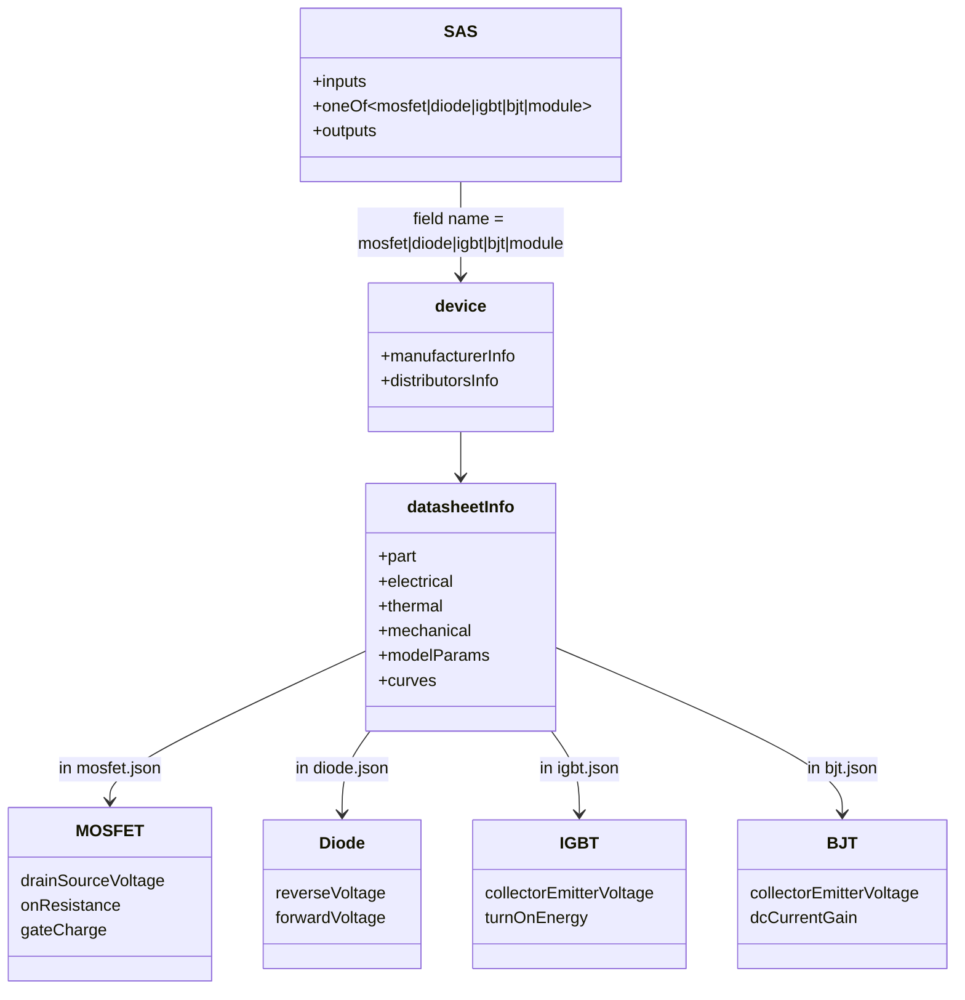
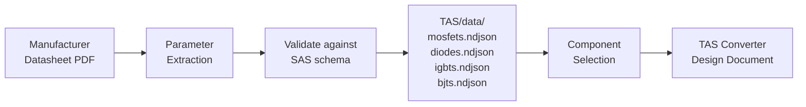

<h1 align="center">SAS - Semiconductor Agnostic Structure</h1>

<p align="center">
  <em>The universal data format for semiconductor components in power electronics</em>
</p>

<p align="center">
  <a href="https://opensource.org/licenses/MIT"></a>
  <a href="https://json-schema.org/"></a>
</p>

---

## What is SAS?

**SAS is a standardized way to describe semiconductor components** -- MOSFETs, diodes, IGBTs, BJTs, and multi-die power modules -- used in power electronics. It captures everything from absolute maximum ratings and electrical characteristics to SPICE model parameters and characteristic curves, all in a single machine-readable JSON file.

SAS is part of the **OpenConverters** family of agnostic structures:

```
PEAS (Power Electronics Agnostic Structure) -- Universal container
 |
 +-- MAS (Magnetic Agnostic Structure) -- Inductors, transformers, chokes
 +-- CAS (Capacitor Agnostic Structure) -- Capacitors
 +-- SAS (Semiconductor Agnostic Structure) -- MOSFETs, diodes, IGBTs, BJTs, power modules
 +-- RAS (Resistor Agnostic Structure) -- Resistors
```

Every valid SAS document is also a valid PEAS document. SAS is a sibling to MAS (for magnetics) and CAS (for capacitors), all sharing the same three-section `inputs / component / outputs` architecture defined by PEAS.

### SAS/data/ vs TAS/data/

An important distinction: **SAS/data/** is reserved for manufacturing building blocks -- semiconductor dies and packages -- and is **currently empty** (the former seed records were finished orderable parts and were moved out; those parts live in **TAS/data/** alongside the ~29k other catalogued semiconductors). **Finished semiconductor components** (the parts you actually order and solder) always go in **TAS/data/**: think of SAS/data/ as the bill of materials for the semiconductor fab, and TAS/data/ as the distributor catalog.

### The Problem SAS Solves

| Without SAS | With SAS |
|-------------|----------|
| MOSFET specs scattered across datasheets and spreadsheets | **One file** with all electrical, thermal, and mechanical data |
| Manual extraction of SPICE parameters from datasheets | **modelParams** section ready for simulation |
| No machine-readable format for characteristic curves | **curves** section with digitized datasheet graphs |
| Different formats for MOSFETs vs diodes vs IGBTs | **One schema family** with a per-device file selected by field name (`oneOf` over `mosfet`/`diode`/`igbt`/`bjt`/`module`) |
| Ambiguous parameter conditions (R_DS(on) at which V_GS?) | **Explicit test conditions** stored alongside every spec |

---

## How It Works

### The Three Sections

Every SAS document has three parts, matching the PEAS pattern:

```
+----------------+     +------------------+     +----------------+
|     INPUTS     |     |  SEMICONDUCTOR   |     |    OUTPUTS     |
+----------------+     +------------------+     +----------------+
| What you NEED  |  +  | What it IS       |  =  | What you GET   |
|                |     |                  |     |                |
| Design         |     | Part info        |     | Conduction     |
| requirements   |     | Electrical specs |     | losses         |
| Operating      |     | SPICE params     |     | Switching      |
| points         |     | Curves           |     | losses         |
|                |     | Thermal data     |     | Junction       |
|                |     | Mechanical dims  |     | temperature    |
+----------------+     +------------------+     +----------------+
```

### The field-name discriminator

`SAS.json` carries `inputs`, `outputs`, and **exactly one** of
`{mosfet, diode, igbt, bjt, module}` — enforced by a top-level `oneOf`. **The field name
*is* the discriminator; there is no `deviceType` property.** Each device field
`$ref`s its own schema file, so a MOSFET document simply has no `diode` key and
vice versa:

```
SAS.json
  +-- inputs           ./inputs.json
  +-- oneOf (exactly one of):
  |     +-- mosfet     ./mosfet.json
  |     +-- diode      ./diode.json
  |     +-- igbt       ./igbt.json
  |     +-- bjt        ./bjt.json
  |     +-- module     ./module.json   (multi-die power module)
  +-- outputs[]        ./outputs.json  (aligned positionally with inputs.operatingPoints)
```

Each device file has the same outer shape — `manufacturerInfo` (+ nested
`datasheetInfo`) and `distributorsInfo` — and its `datasheetInfo` carries the
**device-specific** sections directly (no `mosfetElectrical`/`diodeElectrical`
prefixes — the file it lives in already fixes the device type):

```
<device>.json                       (mosfet | diode | igbt | bjt | module)
  +-- manufacturerInfo
  |     +-- name, reference, status, family, datasheetUrl, spiceModel, ...
  |     +-- datasheetInfo
  |           +-- part         (required)  partNumber, technology, subType, case
  |           +-- electrical   (required)  device-specific ratings
  |           +-- thermal                  R_th, T_j range, Foster network
  |           +-- mechanical               package dims, assembly type
  |           +-- modelParams              SPICE parameters   (not bjt)
  |           +-- curves                   digitized graphs   (not bjt)
  |           +-- provenance               data-source trail
  +-- distributorsInfo                cost/stock/MOQ/packaging per distributor
  +-- spiceModel                      structured .model card, for parts whose
                                      only source is a simulation model
```

A device body must carry `manufacturerInfo` **or** the device-body `spiceModel`
(or be empty). `part.subType` is narrowed by each device file to a **closed
per-device enum**: mosfet `nChannel`/`pChannel`/`powerBlock`, diode
`rectifier`/`schottky`/`sicSchottky`/`fastRecovery`/`ultrafast`/`zener`/`tvs`/`esd`,
igbt `nChannel`, bjt `npn`/`pnp`, module (mirrors its `electrical.topology` enum:
`halfBridge`, `fullBridge`, `sixpack`, ...).

This means a MOSFET file never has empty diode fields, and a diode file never has
empty MOSFET fields — each device type only carries the fields relevant to it.


```mermaid
classDiagram
    class SAS {
        +inputs
        +oneOf~mosfet|diode|igbt|bjt|module~
        +outputs
    }
    class device {
        +manufacturerInfo
        +distributorsInfo
    }
    class datasheetInfo {
        +part
        +electrical
        +thermal
        +mechanical
        +modelParams
        +curves
    }
    class MOSFET {
        drainSourceVoltage
        onResistance
        gateCharge
    }
    class Diode {
        reverseVoltage
        forwardVoltage
    }
    class IGBT {
        collectorEmitterVoltage
        turnOnEnergy
    }
    class BJT {
        collectorEmitterVoltage
        dcCurrentGain
    }
    SAS --> device : field name = mosfet|diode|igbt|bjt|module
    device --> datasheetInfo
    datasheetInfo --> MOSFET : in mosfet.json
    datasheetInfo --> Diode : in diode.json
    datasheetInfo --> IGBT : in igbt.json
    datasheetInfo --> BJT : in bjt.json
```


```mermaid
flowchart LR
    DS["Manufacturer<br/>Datasheet PDF"] --> Extract["Parameter<br/>Extraction"]
    Extract --> Validate["Validate against<br/>SAS schema"]
    Validate --> NDJSON["TAS/data/<br/>mosfets.ndjson<br/>diodes.ndjson<br/>igbts.ndjson<br/>bjts.ndjson"]
    NDJSON --> Select["Component<br/>Selection"]
    Select --> TAS["TAS Converter<br/>Design Document"]
```

Note the TAS catalog records are **PEAS-wrapped**: each NDJSON line is
`{"semiconductor": {"mosfet": {...}}}` (or `diode`/`igbt`/`bjt`), i.e. the SAS
device body nested under PEAS's `semiconductor` discriminator — not a bare SAS
document.

---

## Device Type Coverage

### MOSFET (Si, SiC, GaN, GaAs)

- **electrical** -- V_DS, R_DS(on), I_D, V_GS(th), gate charge (Q_g, Q_gs, Q_gd), capacitances (C_iss, C_oss, C_rss), switching times, body diode specs, avalanche energy, figure of merit
- **modelParams** -- SPICE Level 3 parameters: VTO, KP, LAMBDA, RD, RS, CGS, CGD, CDS, IS, N
- **curves** -- R_DS(on) vs T_j, R_DS(on) vs I_D, C_iss/C_oss/C_rss vs V_DS, gate charge curve, body diode V_F, SOA, thermal impedance

### Diode (Rectifier, Schottky, SiC Schottky, Fast/Ultrafast, Zener, TVS, ESD)

- **electrical** -- V_RRM, I_F(AV), V_F, I_FSM, t_rr, Q_rr, C_j, plus Zener fields (V_BR = V_Z, I_ZT, Z_ZT) and TVS/ESD fields (V_RWM, V_C, I_PP, P_PP, IEC 61000-4-2 contact/air ratings)
- **modelParams** -- SPICE parameters: IS, N, RS, CJ0, VJ, M, TT, BV, IBV
- **curves** -- V_F vs I_F, V_F vs T_j, I_R vs V_R, C_j vs V_R, thermal impedance, SOA

### IGBT

- **electrical** -- V_CE, V_CE(sat), I_C, E_on, E_off, Q_g, V_GE(th), C_ies, short-circuit time
- **modelParams** -- SPICE parameters: VTO, KP, EON, EOFF
- **curves** -- V_CE(sat) vs I_C, E_on vs I_C, E_off vs I_C, thermal impedance, SOA

### BJT

- **electrical** -- V_CEO, V_CBO, I_C, h_FE, V_CE(sat), f_T, P_D
- No modelParams or curves sections defined (BJTs are rarely used in new power designs)

### Power Module (Si IGBT, Si/SiC MOSFET, GaN HEMT dies)

- **electrical** -- `topology` (halfBridge, fullBridge, sixpack, boost, buck, chopper, singleSwitch, dualCommonSource, dualIndependent, asymmetricBridge, sixpackWithBrake, pim, threeLevel — derived from the Digi-Key IGBT-module Configuration filter + the Vincotech topology catalog), `switchTechnology` (siliconIgbt / siliconMosfet / sicMosfet / ganHemt), `numberOfSwitches`, per-switch ratings **reusing the discrete shapes by `$ref`** (`switch` is `mosfet.json`'s or `igbt.json`'s electrical block, pinned by switchTechnology), separate co-pack `diode` ratings (`diode.json`'s electrical block), loop-measured `switchingEnergy` (E_on/E_off + test conditions), baseplate `isolationVoltage`, integrated NTC (`ntcIntegrated`, R25, B-value)
- **mechanical** -- adds `terminalStyle` (screw / pressFit / solderPin / spring / busbar)
- **curves** -- R_DS(on) vs T_j, V_CE(sat) vs I_C, E_on/E_off vs I, diode V_F, thermal impedance, SOA
- No modelParams section (a single .model card cannot describe a multi-die module)

---

## SPICE Model Parameters

MOSFETs, diodes, and IGBTs have a dedicated `modelParams` section containing the parameters needed to build a SPICE simulation model:

```json
"modelParams": {
    "level": 3,
    "vto": 3.0,
    "kp": 350,
    "lambda": 0.01,
    "rd": 0.0008,
    "rs": 0.0008,
    "cgs": 8.5e-9,
    "cgd": 0.098e-9,
    "cds": 2.7e-9,
    "is": 1e-12,
    "n": 1.5
}
```

These values can be used directly in ngspice `.MODEL` statements or other SPICE simulators.

Separately, every device body (all four types) accepts a top-level `spiceModel` — a structured `.model` card (`modelName`, `modelType`, `parameters`) that serves as the canonical home for parts whose only source is a simulation model rather than a datasheet.

---

## Characteristic Curves

Curves are stored as paired arrays of X and Y data points, digitized from datasheet graphs:

```json
"curves": {
    "rdsOnVsTj": {
        "xData": [-40, 25, 75, 125, 150, 175],
        "yData": [0.0012, 0.0017, 0.0024, 0.0032, 0.0037, 0.0043]
    },
    "cossVsVds": {
        "xData": [1, 5, 10, 25, 50, 80, 100],
        "yData": [40e-9, 10e-9, 5.5e-9, 2.8e-9, 1.5e-9, 0.9e-9, 0.7e-9]
    }
}
```

This format enables loss calculations at arbitrary operating points via interpolation, without requiring access to the original datasheet PDF.

---

## Thermal Model

The `thermal` section is shared across all device types and includes:

- **Static thermal resistances**: R_th(j-c), R_th(j-a), R_th(c-s) in K/W
- **Junction temperature limits**: T_j min and max in Celsius
- **Foster RC network**: An array of {resistance, timeConstant} pairs for transient thermal impedance modeling

```json
"thermal": {
    "thermalResistanceJunctionCase": 0.7,
    "thermalResistanceJunctionAmbient": 62,
    "junctionTemperatureMax": 175,
    "junctionTemperatureMin": -55,
    "fosterNetwork": [
        { "resistance": 0.1, "timeConstant": 0.001 },
        { "resistance": 0.3, "timeConstant": 0.01 },
        { "resistance": 0.3, "timeConstant": 0.1 }
    ]
}
```

The Foster network allows accurate transient thermal simulation -- essential for pulsed load applications and SOA analysis.

---

## Schema Structure

```
SAS/
+-- schemas/
|   +-- SAS.json              Top-level: inputs + (one of mosfet/diode/igbt/bjt) + outputs
|   +-- mosfet.json           MOSFET device data
|   +-- diode.json            Diode device data (per-subType required-field rules)
|   +-- igbt.json             IGBT device data
|   +-- bjt.json              BJT device data
|   +-- module.json           Multi-die power module data (topology + per-switch $refs)
|   +-- inputs.json           Operating points + design requirements
|   +-- inputs/
|   |   +-- designRequirements.json
|   +-- outputs.json          Per-operating-point computed results
|   +-- utils.json            Shared SAS defs: part, thermal, mechanical, spiceModel
|                             (dimensionWithTolerance, curve, etc. come from PEAS utils)
|
+-- examples/
|   +-- 01_mosfet_ipb017n10n5.json   100V Si n-channel MOSFET (reference document)
|   +-- 02_diode_stps30l60ct.json    60V Si Schottky diode    (reference document)
|   +-- 03_module_ff2mr12w3m1h.json  1200V SiC half-bridge module (reference document)
|
+-- src/                      C++ converter layer (semiconductor PEAS -> CIAS)
+-- tests/                    pytest schema tests + C++ converter tests
|
+-- docs/
    +-- schema.md             Detailed field-by-field schema reference
```

There is no populated `data/` directory in SAS (see
[SAS/data/ vs TAS/data/](#sasdata-vs-tasdata) above): finished parts live in
`TAS/data/`.

---

## Examples Walkthrough

### Example 1: MOSFET -- Infineon IPB017N10N5

File: `examples/01_mosfet_ipb017n10n5.json`

A 100V / 1.7 mOhm Si n-channel MOSFET in the OptiMOS 5 family, packaged in TO-263-3 (D2PAK).

Key features demonstrated:
- Complete electrical section with all MOSFET-specific fields: V_DS=100V, R_DS(on)=1.7mOhm at V_GS=10V/I_D=100A, V_GS(th) as min/nom/max, gate charge breakdown (Q_g, Q_gs, Q_gd), capacitances at specified V_DS, body diode specs, figure of merit
- SPICE Level 3 model parameters ready for simulation
- Two characteristic curves: R_DS(on) vs T_j and C_oss vs V_DS
- Thermal data: R_th(j-c)=0.7 K/W, T_j range -55 to 175C
- Mechanical dimensions as `dimensionWithTolerance` objects in metres, `assemblyType: "smt"`
- Distributor info with Digi-Key stock, `{value, currency}` pricing, MOQ, and packaging (commercial data lives per-distributor -- there is no `business` section)
- A full `inputs` block: one operating point (drain port, rectangular waveforms) plus seed-friendly `designRequirements` (`deviceType: "mosfet"`, optional rated fields)

### Example 2: Diode -- ST STPS30L60CT

File: `examples/02_diode_stps30l60ct.json`

A 60V / 30A Si Schottky diode in TO-220AB package.

Key features demonstrated:
- Diode-specific electrical section: V_RRM=60V, I_F(AV)=30A, V_F=0.42V at I_F=15A, surge current, junction capacitance (`subType: "schottky"` puts it in the rectifier family, so V_RRM/V_F/I_F are the required trio)
- SPICE diode model parameters: IS, N, RS, CJ0, VJ, M, BV
- Two characteristic curves: V_F vs I_F and C_j vs V_R
- Through-hole assembly type (`assemblyType: "tht"`)

### Example 3: Power Module -- Infineon FF2MR12W3M1H_B11

File: `examples/03_module_ff2mr12w3m1h.json`

A 1200V / 1.44 mOhm CoolSiC MOSFET half-bridge in the EasyDUAL 3B (EasyPACK) housing with
PressFIT terminals and an integrated NTC.

Key features demonstrated:
- `topology: "halfBridge"`, `switchTechnology: "sicMosfet"`, `numberOfSwitches: 2`
- The `switch` block reuses the **mosfet electrical shape by $ref**: V_DS=1200V,
  R_DS(on)=1.44mOhm at V_GS=18V/I_D=400A, V_GS(th) as min/nom/max, capacitances at 800V,
  switching times, body diode specs
- Module-level data a discrete part does not have: `switchingEnergy` (E_on=17.7mJ,
  E_off=2.83mJ at 600V/400A, measured in the module's own commutation loop),
  `isolationVoltage: 3000` (V RMS), `ntcIntegrated: true` with R25=5kOhm and B25/100=3433K
- Baseplate-less module thermal: the datasheet's R_th(j-s)=0.128 K/W per switch stored in
  `thermalResistanceJunctionCase`
- `terminalStyle: "pressFit"` in the module-specific mechanical section
- A `module` designRequirements branch: `moduleTopology`, `allowedSwitchTechnologies`,
  `ratedBlockingVoltage`, `minimumIsolationVoltage`, `requireIntegratedNtc`

---

## Quick Reference: Fields by Device Type

### Shared Sections (all device types)

| Section | Key Fields |
|---------|------------|
| **part** | partNumber, technology, subType (per-device closed enum), case, package, qualification |
| **thermal** | R_th(j-c), R_th(j-a), R_th(c-s), T_j min/max, fosterNetwork |
| **mechanical** | assemblyType (PEAS connectionType: smt/tht/chassis/...), case, length, width, height, weight |
| **provenance** | data-source trail: source, sourceName, sourceUrl, retrievedDate, fields |
| **distributorsInfo** | per-distributor commercial data: cost {value, currency}, stock, packaging, vpe, moq, leadTime |

### Device-Specific Sections

| Field | MOSFET | Diode | IGBT | BJT |
|-------|--------|-------|------|-----|
| **Voltage rating** | drainSourceVoltage | reverseVoltage | collectorEmitterVoltage | collectorEmitterVoltage |
| **Current rating** | continuousDrainCurrent | forwardCurrent | continuousCollectorCurrent | collectorCurrent |
| **On-state loss param** | onResistance | forwardVoltage | collectorEmitterSaturation | saturationVoltage |
| **Gate/base threshold** | gateThresholdVoltage | -- | gateThresholdVoltage | -- |
| **Switching energy** | (from Q_g, times) | -- | turnOnEnergy, turnOffEnergy | -- |
| **Capacitances** | C_iss, C_oss, C_rss | C_j | C_ies | -- |
| **Gate charge** | Q_g, Q_gs, Q_gd | -- | Q_g | -- |
| **Reverse recovery** | t_rr, Q_rr (body diode) | t_rr, Q_rr | -- | -- |
| **Current gain** | -- | -- | -- | h_FE (dcCurrentGain) |
| **SPICE params** | modelParams | modelParams | modelParams | -- |
| **Curves** | curves | curves | curves | -- |

### Required Fields by Device Type

| Device Type | Required Electrical Fields |
|-------------|--------------------------|
| **mosfet** | drainSourceVoltage, onResistance, continuousDrainCurrent, gateThresholdVoltage, totalGateCharge |
| **diode** | depends on `part.subType`: rectifier family (or no subType) -> reverseVoltage, forwardVoltage, forwardCurrent; zener -> breakdownVoltage, powerDissipation; tvs -> standoffVoltage, clampingVoltage + a pulse rating; esd -> standoffVoltage + a pulse rating |
| **igbt** | collectorEmitterVoltage, collectorEmitterSaturation, continuousCollectorCurrent |
| **bjt** | collectorEmitterVoltage, collectorCurrent |
| **module** | topology, switchTechnology, numberOfSwitches, switch (whose own required set is the mosfet or igbt one above, per switchTechnology) |

---

## Data Files

SAS ships **no part data**: the `data/` directory is empty by design. It is reserved for
manufacturing building blocks (semiconductor dies and packages), none of which have been
catalogued yet. All finished, orderable semiconductors live in `TAS/data/`
(`mosfets.ndjson`, `diodes.ndjson`, `igbts.ndjson`, `bjts.ndjson`) as PEAS-wrapped
`{"semiconductor": {...}}` records validated against these SAS schemas.

---

## Detailed Documentation

See [docs/schema.md](docs/schema.md) for the complete field-by-field schema reference with types, units, enum values, and required/optional status.

---

## License

This project is licensed under the MIT License -- see [LICENSE](LICENSE).

---

<p align="center">
  Part of the <a href="https://github.com/OpenConverters">OpenConverters</a> project
</p>
